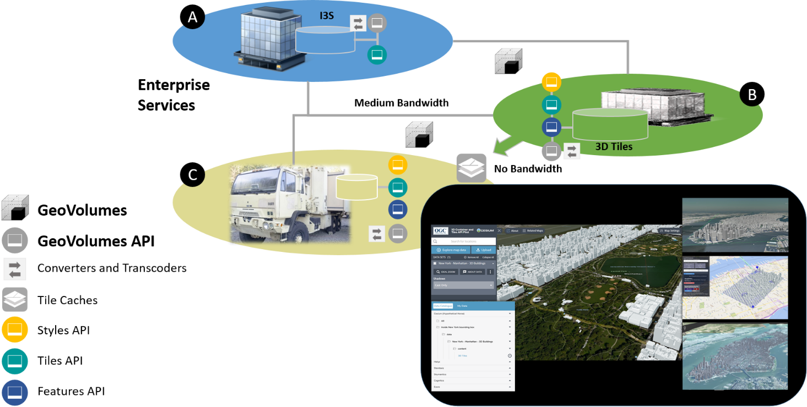
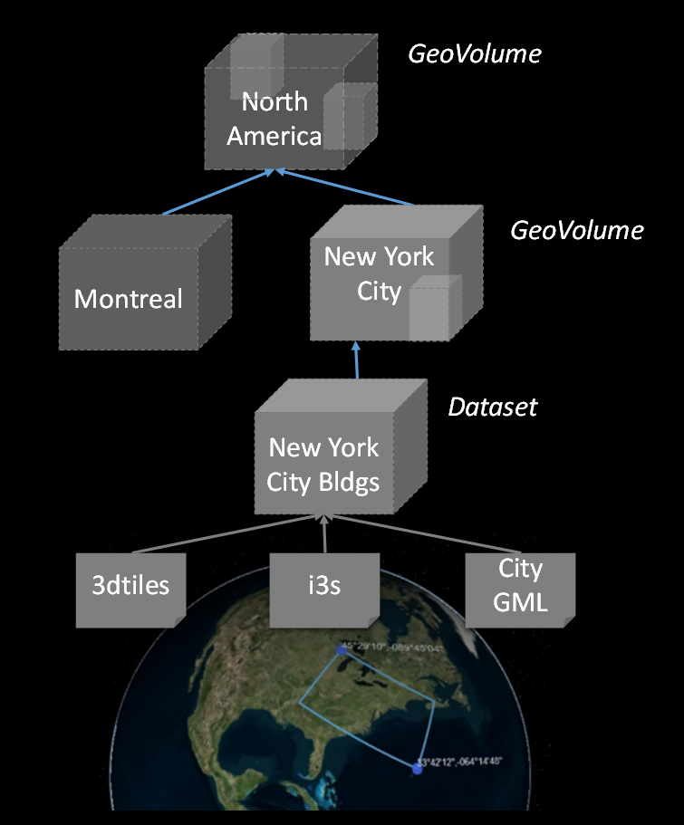
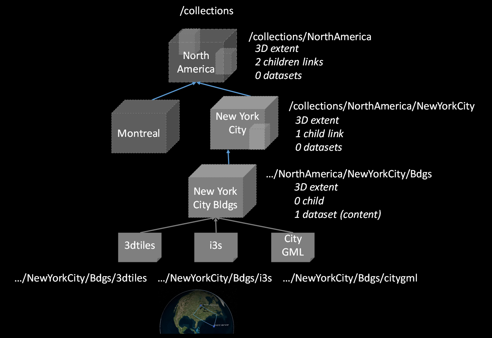
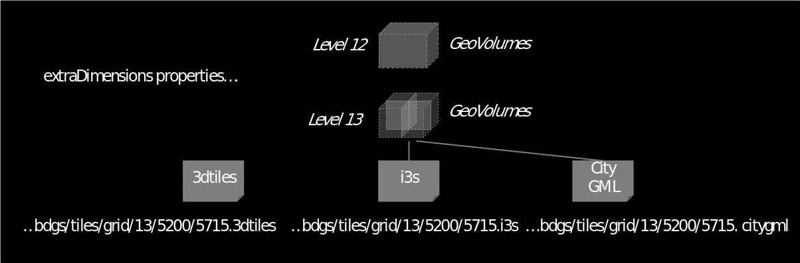
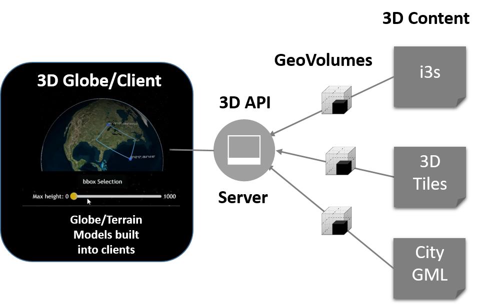

== Scope

The OGC API - 3D GeoVolumes candidate Standard specifies an Application Programming Interface (API) and encoding that organizes access to a variety of 3D content according to a hierarchy of 3D geospatial volumes (GeoVolumes). The goal of the candidate Standard is to allow applications to request a variety of 3D content from different providers in an interoperable and standardized way.

OGC API - 3D GeoVolumes is based on Open Geospatial Consortium (OGC) and OpenAPI principles. The API is consistent with OGC API – Common – Part 1: Core building blocks and supports link-follow, bounding box query, and tile coordinate methods of access to resources of interest.

The objective of the 3D GeoVolumes API and resource model is not to replace existing distribution methods and models for 3D content such as OGC 3D Tiles and I3S, but to enable interoperability between them.

The content provided within this document is derived largely from work done during collaborative, hands-on engineering conducted by members of the OGC during late 2019 and early 2020.

=== Why 3D GeoVolumes

OGC API - 3D GeoVolumes is needed because a variety of solutions and standards exist to access and transfer 3D geospatial content (e.g. 3D Tiles, I3S, glTF and others). OGC API - 3D GeoVolumes addresses the challenge of accessing and transferring 3D geospatial content in a variety of standards by providing a resource model and single API for requesting, receiving, and distributing this content, thus simplifying application development across geospatial enterprises. The 3D GeoVolumes API and resource model use a space-centric perspective to allow efficient access to 3D content.

This OGC API is not intended to replace existing distribution methods and models for 3D content, but to enable interoperability between them.

A high-level representation of a geospatial enterprise implementing 3D GeoVolumes based on the needs of various types of entities and/or systems ('A'), ('B'), and ('C') is illustrated in the figure below. The demonstration scenario involves siting a field hospital in Central Park, New York City during a global pandemic.

.The GeoVolumes API allows access to a variety of 3D content from different providers in a standardized way

The three systems differ in the 3D content standards implemented, volume of data that can be stored and processed, supported analytics and available bandwidth for data transport between entities, with 'A' having the highest bandwidth and 'C' having the lowest bandwidth.

Despite these differences, 3D GeoVolumes provides a model that allows offering, discovering, requesting and accessing data at each entity using a common API on top of a single organizational model of 3D geospatial resources. This common API leverages available 3D geospatial data formats and distribution standards such as 3D Tiles [https://www.ogc.org/standards/3DTiles[https://www.ogc.org/standards/3DTiles]], I3S [https://www.ogc.org/standards/i3s[https://www.ogc.org/standards/i3s]], CityGML [https://www.ogc.org/standards/citygml[https://www.ogc.org/standards/citygml]], and CDB [https://www.ogc.org/standards/cdb[https://www.ogc.org/standards/cdb]] to ensure users can work with 3D geospatial content in the optimal distribution format and interaction method for their application task. High bandwidth capacity data centers ('A') have 3D content available for broad regions or on a global scale. Content can be made available in multiple datasets and distributions based on conversion and transcoding workflows. Access to the data can be offered to other entities in the enterprise by means of the 3D GeoVolumes API. Depending on users' needs, data can be made available through alternative API methods in 2D or in raw format, such as the https://ogcapi.ogc.org/tiles[OGC API - Tiles] Standard or the https://ogcapi.ogc.org/features[OGC API - Features] Standard.

Medium bandwidth capacity data centers ('B') do not require all data that is available at the data center ('A') but are more selective according to their role. The amount of data transferred to ('B') depends on the available bandwidth and specific needs for data analysis and re-distribution. To obtain required data in the best suited format and minimum size, medium bandwidth capacity data centers make use of the specific space-centric indexing scheme that is the fundamental idea of a GeoVolume resource and the corresponding 3D GeoVolumes API offered by ('A').

The high-level architecture defines a third enterprise entity, low bandwidth capacity field operations ('C'). These are connected at various bandwidths including intermittently connected or completely offline situations. In these cases, offline data packaging mechanisms and data volume are operational considerations and optimized data selection and transmission processes are essential. Customers at this level want to go back and forth between 3D geospatial content distributions optimized for visualization via low bandwidth connections and attribute-loaded data that provides detailed information about selected elements in each view.

=== What are 3D GeoVolumes

The previous section provided a high-level representation of a geospatial enterprise implementation of the 3D GeoVolumes API based on the needs of various types of entities and/or systems. The technology described in this API supports this scenario efficiently because 3D GeoVolumes follow a common conceptual organization of space applied by humans, which is a collection of spaces where the spaces contain either sub-spaces or a set of objects. This representation of space is called the Bounding Volume, which is a closed volume containing the union of a set of geometric objects. The figure below illustrates typical Bounding Volumes (Box, Region, Sphere) with enclosed cuboid objects.

.Bounding Volumes (Box, Region, Sphere) with enclosed cuboid objects
image::../images/004.png[width=800]

The space organized in this manner may describe a collection of disjoint GeoVolumes, hierarchical collections of GeoVolumes or GeoVolumes accessed by tile coordinates organized in an OGC tiling scheme. The concepts of disjoint and hierarchical collections of GeoVolumes are illustrated in the figure below where the GeoVolume "North America" contains two child GeoVolumes "Montreal" and "New York City". &nbsp;Both are spatially disjoint. The GeoVolume "New York City" contains a single 3D Dataset representing buildings. These buildings are available in multiple distribution formats (3D Tiles, I3S and CityGML).

.GeoVolumes in nested hierarchy with a 3D dataset and multiple distributions

In these constructs, each GeoVolume may have one or more children whose extents may themselves overlap but in aggregate are completely contained in the parent volume extent. Each GeoVolume can contain references to and descriptions of the extent of dataset(s) of its contents and may provide links to multiple distributions of that dataset in different formats or encodings, e.g. 3D Tiles, I3S. GeoVolumes in this model may be accessed as /collections by an API. This API standard does not identify mandatory requirements for how specific distribution formats or encodings are composed and organized into spatial data structures (e.g. tiling schemes).

.GeoVolumes can reference extent of datasets and link to 'child' GeoVolumes

A GeoVolumes&nbsp;API may optionally&nbsp;access 3D&nbsp;geospatial content&nbsp;as tiles&nbsp;through extensions for tile coordinates. This may be achieved by using an&nbsp;extraDimensions&nbsp;property consisting of a list of identified objects, each with a description on how the additional dimensions are tiled. It may also be achieved by using Implicit Tiling as outlined in the emerging Community Standard for "3D Tiles Next". The two approaches will be harmonized in the GeoVolumes SWG and this specification updated.

If an extraDimensions property consisting of a list of identified objects is used this information can be added to either a&nbsp;TileMatrixSet's&nbsp;TileMatrix&nbsp;or to a&nbsp;TileSet's TileMatrixSetLimit. Including this property in the&nbsp;TileSet'sTileMatrixSetLimits&nbsp;allows for the re-use of common 2D&nbsp;TileMatrixSets&nbsp;for 3D geospatial content.

.GeoVolumes&nbsp;may optionally&nbsp;access 3D&nbsp;geospatial content&nbsp;via tile coordinates

The default representations of a GeoVolume are json/html information documents that define the bounding box/volume, link to an implicit tileset scheme if applicable, and provide links to the actual content. GeoVolumes are organized in collections as described above.

The basic architecture of server components to access 3D GeoVolume encodings is shown in the figure below. Each 3D / Globe client component can access 3D datasets in multiple distribution formats by means of components implementing the GeoVolumes API as an access interface. The API enables access to these resources using the HTTP protocol and its associated methods.

.Basic architecture of server components to access 3D GeoVolumes

Clients then visualize the returned content in the context of a 3D globe rendering either built into the client or assembled onto 2D tiles fetched separately from the GeoVolumes API, using for example, a 2D Tile Server. In the future, 2D tiles could also be accessed through the GeoVolumes API.
