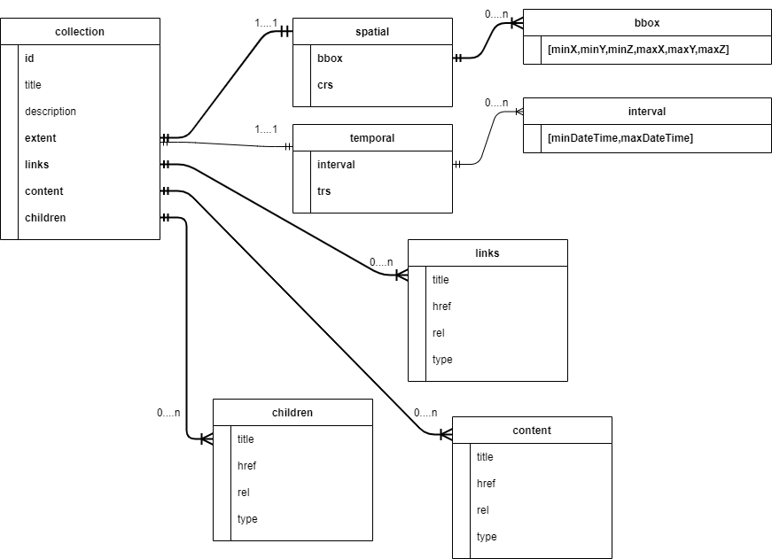

== Requirements Classes

This section outlines requirements for an implementation of the 3D GeoVolumes API.

In addition to these basic requirements, the following requirements/conformance classes apply:

* *Core: Minimal GeoVolumes API capabilities (static web server)*
* *Extension: Adds the option for a spatial query parameter or tile coordinate to limit the result set.*


The 3D GeoVolumes API is designed to be a specialized API based on the OGC API principles that can significantly reduce the burden of implementing new clients and APIs as the specification only requires a minimal set of content/parameters needed to transfer 3D data, features, and attributes through an API.&nbsp;

This 3D GeoVolumes API follows the standards and conventions provided in the OGC API - Common for Web APIs. The 3D GeoVolumes API conforms to the OGC API - Common foundation resources: landing page, API definition, conformance, and collections (spatial resources).

The 3D GeoVolumes APIsupports the resources and operations listed in Table 1 with the associated conformance class and the link to the document section that specifies the requirements.

.GeoVolumes API - Overview of resources and applicable HTTP methods
|===
| *Resource* | *Path* | *HTTP Method* | *Description*

| Landing Page | / | GET | The landing page

| Conformance Declaration | /conformance | GET | The conformance information
| API Definition | /api | GET | The API Definition document
| Collections | /collections | GET | Collections
| 3D Container | /collections/{3DContainerId} | GET | 3D-Container

|===

=== Requirements Class "Core"

All resources are available in a 'Core' requirements class, i.e. all GeoVolumes APIs will support them.

[[rc_core]]

[requirements_class]
====
[%metadata]
label:: http://www.opengis.net/spec/ogcapi-geovolumes-1/1.0/req/core
subject:: Web API
inherit:: <<OGC19-072,OGC API – Common – Part 1: Core>>
inherit:: <<rfc8259,JSON>>
====

==== Landing page

The entry point to the API (/). The landing page provides links to the service description, API definition (/api), conformance declaration (/conformance) and collections (/collections).

===== Operation

[requirement]
====
[%metadata]
label:: /req/core/root-op
part:: The server SHALL support the HTTP GET operation on the URI {root}/.
====

===== Response

[requirement]
====
[%metadata]
label:: /req/core/root-success
part:: A successful execution of the operation SHALL be reported as a response with a HTTP status code 200.
part:: The content of that response SHALL be based upon the schema https://raw.githubusercontent.com/opengeospatial/ogcapi-3d-geovolumes/main/standard/openapi/schemas/landingPage.yaml[landingPage.yaml] and include links to the following resources:

* the API Definition (relation type 'service-desc' or 'service-doc')
* the Conformance Declaration (relation type /conformance&nbsp;(relation type ' http://www.opengis.net/def/rel/ogc/1.0/conformance[http://www.opengis.net/def/rel/ogc/1.0/conformance] ')
* /collections&nbsp;(relation type 'data')
====

A sample schema for the landing page of the GeoVolumes API is provided below.

[source%unnumbered,yaml]
----
type: object
required:
  - links
properties:
  title:
    type: string
    example:
  description:
    type: string
    example:
  links:
    type: array
    items:
      $ref: link.yaml
----


A sample landing page response document of an GeoVolumes API is provided below.

[source%unnumbered,json]
----
{
"title": "OGC 3D Pilot",
"description": "A Pilot of an API for GeoVolumes",
"links": [
    {
      "href": " http://data.example.org/[http://data.example.org/]",
      "rel": "service-desc",
      "type": "application/json",
      "title": "Service Description"
    },
    {
      "href": " http://data.example.org/api[http://data.example.org/api]",
      "rel": "service",
      "type": "application/json",
      "title": "the API definition"
    },
    {
      "href": " http://data.example.org/conformance[http://data.example.org/conformance]",
      "rel": "conformance",
      "type": "application/json",
      "title": "Conformance"
    },
    {
      "href": " http://data.example.org/collections[http://data.example.org/collections]",
      "rel": "data",
      "type": "application/json",
      "title": "Collections"
    }
  ]
}
----

===== Error situations

See HTTP Status Codes in Appendix A - Web API<<appendix_a>> for general guidance.

==== Declaration of Conformance Classes

The Conformance Declaration states the conformance classes from standards or community specifications, identified by a URI, to which the API conforms. The conformance resource requires no parameters. The HTTP /conformance GET response returns the list of URIs of conformance classes implemented by the server in JSON.

===== Operation

[requirement]
====
[%metadata]
label:: /req/core/conformance-op
part:: The server SHALL support the HTTP GET operation on the URI &nbsp;/{root}/conformance.
part:: The server SHALL support the HTTP GET operation on all links from the landing page that have the relation type http://www.opengis.net/def/rel/ogc/1.0/conformance[http://www.opengis.net/def/rel/ogc/1.0/conformance].
part:: The responses to all HTTP GET requests issued in A and B server SHALL satisfy requirement */req/core/conformance-success.*
====

[requirement]
====
[%metadata]
label:: /req/core/conformance-success
part:: A successful execution of the operation SHALL be reported as a response with a HTTP status code 200.
part:: The content of that response SHALL be based upon the schema https://raw.githubusercontent.com/opengeospatial/ogcapi-3d-geovolumes/main/standard/openapi/schemas/confClasses.yaml[confClasses.yaml] and list all OGC API conformance classes that the API conforms to.
====

===== Response

A sample schema for the list of conformance classes is provided below.

[source%unnumbered,yaml]
----
type: object
required:
  - conformsTo
properties:
  conformsTo:
    type: array
    items:
      type: string
----

The following example of the conformance declaration of a 3D GeoVolumes API was taken from the "OGC API – Tiles - 3D (GeoVolumes) Engineering Report":

[source%unnumbered,json]
----
{
  "conformsTo": [
    " http://www.opengis.net/spec/ogcapi-geovolumes-1/1.0/conf/core[http://www.opengis.net/spec/ogcapi-geovolumes-1/1.0/conf/core]",
    " http://www.opengis.net/spec/ogcapi-geovolumes-1/1.0/conf/oas30[http://www.opengis.net/spec/ogcapi-geovolumes-1/1.0/conf/oas30]",
    " http://www.opengis.net/spec/ogcapi-geovolumes-1/1.0/conf/json[http://www.opengis.net/spec/ogcapi-geovolumes-1/1.0/conf/json]"
    ]
}
----

===== Error situations

See HTTP Status Codes in Appendix A - Web API<<appendix_a>> for general guidance.

==== API Definition


The _API Definition_ describes the capabilities of the server that can be used by clients to connect to the server or by development tools to support the implementation of servers and clients. Accessing the _API Definition_ using HTTP GET returns a description of the API.


===== Operation


[requirement]
====
[%metadata]
label:: /req/core/api-definition-op
part:: The URIs of all API definitions referenced from the landing page SHALL support the HTTP GET method.
====


[width=100%]
|===
h| *Permission 1* h| */req/core/api-definition-uri*
| A | The API definition is metadata about the API and strictly not part of the API itself, but it MAY be hosted as a sub-resource to the base path of the API, for example, at path&nbsp;/api. There is no need to include the path of the API definition in the API definition itself.

|===

Note that multiple API definition formats can be supported.


===== Response

[width=100%]
|===
h| *Recommendation 1* h| */rec/core/api-definition-oas*
| A | A JSON representation of the API definition document SHOULD conform to the&nbsp;OpenAPI Specification 3.0, the document.

|===


//Requirement 6

[requirement]
====
[%metadata]
label:: /req/core/api-definition-success
part:: A GET request to the URI of an API definition linked from the landing page (link relations&nbsp;service-desc&nbsp;or&nbsp;service-doc) with an&nbsp;Accept&nbsp;header with the value of the link property&nbsp;type&nbsp;SHALL return a document consistent with the requested media type.
====


If the server hosts the API definition under the base path of the API (for example, at path&nbsp;/api, see above), there is no need to include the path of the API definition in the API definition itself.

The idea is that any 3D GeoVolumes API implementation can be used by developers that are familiar with the API definition language(s) supported by the server. The developer may need to learn about 3D data types, etc., but it should not be required to read this specification to access the data via the API.

The following is an example of the API definition.

[source%unnumbered,json]
----
{
"links": [
    {
      "href": " http://data.example.org/[http://data.example.org/]",
      "rel": "self",
      "type": "application/json",
      "title": "this document"
    },
    {
      "href": " http://data.example.org/api[http://data.example.org/api]",
      "rel": "service",
      "type": "application/json",
      "title": "the API definition"
    },
    {
      "href": " http://data.example.org/conformance[http://data.example.org/conformance]",
      "rel": "conformance",
      "type": "application/json",
      "title": "conformance classes implemented by this server"
    },
    {
      "href": " http://data.example.org/collections[http://data.example.org/collections]",
      "rel": "data",
      "type": "application/json",
      "title": "Metadata about the collections"
    }
  ]
}
----

===== Error situations

See HTTP Status Codes in Appendix A - Web API<<appendix_a>> for general guidance.

==== Collections

Collections provides the information to access a collection of GeoVolumes (3D Containers). The collection resources accept the 2D or 3D bounding box (bbox) and format parameter. The resource accepts query or header parameters for the format parameter. The bounding box query parameter lower left: x, y, {z}, and upper right x, y, {z} (z-coordinate is optional) returns GeoVolumes that are within the area. The HTTP /collections GET response returns JSON containing two properties, links (link: URI, type, relationship) and 3D Container.

//Requirement 7

[requirement]
====
[%metadata]
label:: /req/core/collections-op
part:: The server SHALL support the HTTP GET operation at the path&nbsp;/collections.
====

//Requirement 8

[requirement]
====
[%metadata]
label:: /req/core/collections-success
part:: A successful execution of the operation SHALL be reported as a response with a HTTP status code&nbsp;200.
part:: The content of that response SHALL conform to the media type stated in the Content-Type header.
part:: The content of that response SHALL conform to the media type stated in the query string.
part:: The content of that response SHALL be constrained by the bbox stated in the query string.
part:: The content of that response SHALL be based upon the following OpenAPI 3.0 schema:
+
```yaml
type: object
properties:
  links:
    type: array
    items:
      type: object
      required:
        - href
        - rel
      properties:
        href:
          type: string
        title:
          type: string
          nullable: true
        rel:
          type: string
        type:
          type: string
          nullable: true
        hreflang:
          type: string
          nullable: true
    collections:
      type: array
      items:
        $ref: '3dcontainer'

```

====


==== 3D-Container

The collection resources support access to a 3D-Container with a unique identifier (/collections/{3DContainerId}). The format and bounding box parameters in the collections request can be applied to a specific GeoVolume request. The bbox query on a GeoVolume will apply filtering on the contents within the GeoVolume. The HTTP /collections/{3DContainerId} GET response returns JSON representing the 3D-Container (GeoVolume).

//Requirement 9

[requirement]
====
[%metadata]
label:: /req/core/collections/{3DContainerId}-op
part:: The server SHALL support the HTTP GET operation at the path /collections/{3DContainerId}.
====

//Requirement 10

[requirement]
====
[%metadata]
label:: /req/core/collections/{3DContainerId}-success
part:: A successful execution of the operation SHALL be reported as a response with a HTTP status code&nbsp;200.
part:: The content of that response SHALL conform to the media type stated in the Content-Type header.
part:: The content of that response SHALL conform to the media type stated in the query string.
part:: The content of that response SHALL be constrained by the bbox stated in the query string.
part:: The content of that response SHALL be based upon the following OpenAPI 3.0 schema:
+
```yaml
type: object
required:
  - id
  - extent
  - links
properties:
  id:
    type: string
  title:
    type: string
    nullable: true
  description:
    type: string
    nullable: true
    collectionType:
      type: string
      default: '3d-container'
    itemType:
      type: string
      default: 'unknown'
    extent:
      type: object
      properties:
        spatial:
          type: object
          properties:
            bbox:
              type: array
              minItems: 4
              maxItems: 6
              items:
                type: number
            crs:
              type: string
              default:
  'http://www.opengis.net/def/crs/OGC/1.3/CRS84'
          temporal:
            type: object
            properties:
              interval:
                type: array
                nullable: true
                minItems: 1
                  items:
                    type: array
                    minItems: 2
                    maxItems: 2
                    items:
                        type: string
                        format: date-time
                        nullable:  true
             trs:
                  type: string
               nullable: true
               default:
  'http://www.opengis.net/def/uom/ISO-8601/0/Gregorian'
      contentExtent:
          type: array
          nullable: true
          items:
              type: number
              format: double
              minItems: 4
              maxItems: 12
      crs:
          type: string
          default: 'http://www.opengis.net/def/crs/OGC/1.3/CRS84'
      links:
      type: array
      items:
        type: object
        required:
            - href
            - rel
        properties:
            href:
                type: string
            title:
                type: string
                nullable: true
            rel:
                type: string
            type:
                type: string
                nullable: true
            hreflang:
                type: string
                nullable: true
        children:
          type: array
          items:
            $ref: 3dcontainer
        content:
          type: array
          items:
            type: object
            required:
                - href
                - rel
            properties:
                href:
                    type: string
                title:
                    type: string
                    nullable: true
                rel:
                    type: string
                type:
                    type: string
                    nullable: true
                hreflang:
                    type: string
                    nullable: true
```
====


.UML diagram of a 3D-Container (GeoVolume)



See Table B.4 in <<appendix_b>> for additional guidance.


=== Requirements Class "Extension"

This class provides specifics on the extensions to the Collections requirement class. The extensions to the Collections requirement class are as follows:


* The collections path (/collections) is extended by the addition of a bounding box query parameter.
* The collections path (/collections/{3DContainerId}) is extended by the addition of a bounding box query parameter.

The resulting API has the resources listed in the Table below:

.Overview of resources and applicable HTTP methods with "bbox" extension
[width=100%]
|===
| *Resource* | *Path* | *HTTP method* | *Changes*

| Landing page | / | GET | None

| Conformance declaration | /conformance | GET | Returns additional conformance classes
| API | /api | GET | API definition
| Collections | /collections?bbox | GET | Bounding Box parameter added.
| 3D Container | /collections/{3DContainerId}?bbox | GET | Bounding Box parameter added.

|===

The following is an example of the conformance declaration of a 3D GeoVolumes API that implements all requirement classes:

[source%unnumbered,json]
----
{
"conformsTo": [
" http://www.opengis.net/spec/ogcapi-geovolumes-1/1.0/conf/core[http://www.opengis.net/spec/ogcapi-geovolumes-1/1.0/conf/core]",
" http://www.opengis.net/spec/ogcapi-geovolumes-1/1.0/conf/oas30[http://www.opengis.net/spec/ogcapi-geovolumes-1/1.0/conf/oas30]",
" http://www.opengis.net/spec/ogcapi-geovolumes-1/1.0/conf/html[http://www.opengis.net/spec/ogcapi-geovolumes-1/1.0/conf/html]",
"http://www.opengis.net/spec/ogcapi-geovolumes-
1/1.0/conf/spatialquery"
]
}
----

==== Requirements Class "spatial query extension"

The requirement class 'spatialquery' is an extension to the 'Core' requirement class which allows query by spatial and temporal constraints. The server shall return 3D content if any part of the content lies inside the query bbox when querying by spatial constraints.

[requirements_class]
====
[%metadata]
label:: http://www.opengis.net/spec/ogcapi-geovolumes-1/1.0/req/spatialquery
subject:: Web API
inherit:: <<OGC19-072,OGC API – Common – Part 1: Core>>
inherit:: <<rfc8259,JSON>>
====

//Requirement 11

[requirement]
====
[%metadata]
label:: /req/spatialquery/op-1
part:: The server SHALL support the HTTP GET operation at the path/collections?bbox for a 3D Container (GeoVolume).
====

//Requirement 12

[requirement]
====
[%metadata]
label:: /req/spatialquery/op-2
part:: The server SHALL support the HTTP GET operation at the path/collections/{3DContainerId}?bbox for each 3D Container(GeoVolume).
====


//Requirement 13

[requirement]
====
[%metadata]
label:: /req/spatialquery/success
part:: A successful execution of the operation SHALL be reported as aresponse with a HTTP status code 200.
part:: The content of the response SHALL be based upon the following OpenAPI 3.0 schema:
+
```yaml
type: object
required:
  - id
  - extent
  - links
properties:
  id:
    type: string
  title:
    type: string
    nullable: true
  description:
    type: string
    nullable: true
  collectionType:
    type: string
    default: ‘3d-container’
  itemType:
    type: string
    default: ‘unknown’
  extent:
    type: object
    properties:
      spatial:
        type: object
        properties:
          bbox:
            type: array
            minItems: 4
            maxItems: 6
            items:
              type: number
          crs:
            type: string
            default:
‘http://www.opengis.net/def/crs/OGC/1.3/CRS84’
      temporal:
        type: object
        properties:
          interval:
            type: array
            nullable: true
            minItems: 1
              items:
                type: array
                minItems: 2
                maxItems: 2
              items:
                type: string
                format: datetime
                nullable: true
            trs:
              type: string
              nullable: true
              default:
‘http://www.opengis.net/def/uom/ISO-
8601/0/Gregorian’
     contentExtent:
       type: array
       nullable: true
       items:
         type: number
         format: double
         minItems: 4
         maxItems: 12
    crs:
      type: string
      default:
‘http://www.opengis.net/def/crs/OGC/1.3/CRS84’
    links:
      type: array
      items:
        type: object
        required:
          - href
          - rel
        properties:
          href:
            type: string
          title:
            type: string
            nullable: true
          rel:
            type: string
          type:
            type: string
            nullable: true
          hreflang:
            type: string
            nullable: true
        children:
          type: array
          items:
            $ref: 3dcontainer


```
part:: The id member of each spatial query SHALL be unique.
====
